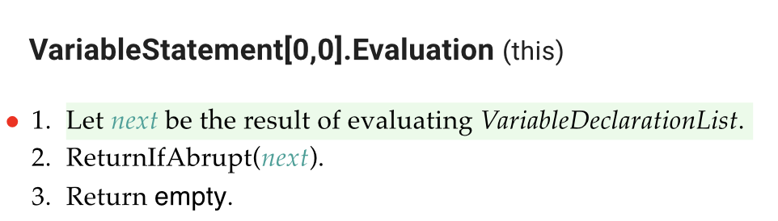
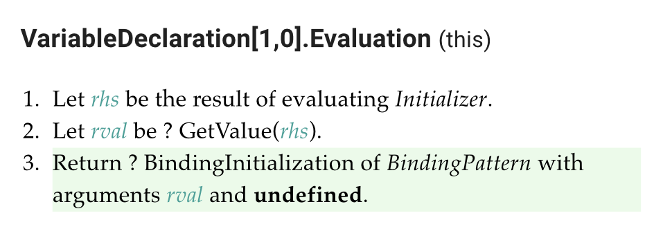
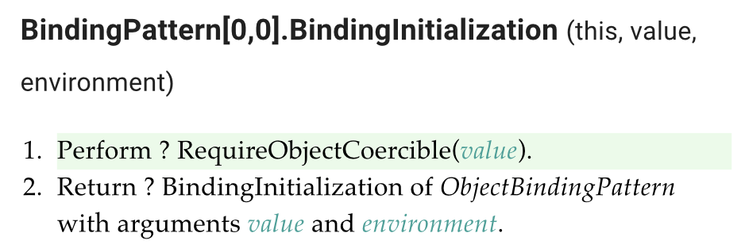
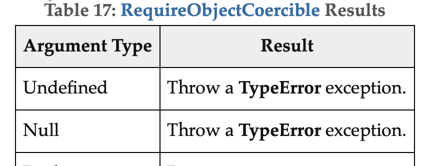

[Bug]: Destructuring null with rest #14982
==========================================

According to the ECMAScript specification, running a JavaScript program `var { ... x } = null ;` is expected to result in `TypeError` but using Babel terminates without error.

Below is a detailed explanation using ECMAScript specification.
Evaluation of `var { ... x } = null ;` is done by following algorithms.

## 1. Evaluation of *VariableStatement* : **var** *VariableDeclarationList* of the ECMAScript specification

The algorithms calls the evaluation of *VariableDeclarationList* in step 1, where *VariableDeclarationList* represents `{ ... x } = null ;`.

## 2. Evaluation of *VariableDeclaration* : *BindingPattern* *Initializer* of the ECMAScript specification

The algorithm calls BindingInitialization of *BindingPattern* with arguments *rval* and **undefined**, where rval is `null`.

## 3. Operation BindingInitialization of the ECMAScript specification

The algorithm calls RequireObjectCoercible, where *value* is `null`.

## 4. Operation RequireObjectCoercible of the ECMAScript specification

RequireObjectCoercible throw `TypeError` exception, when argument type is Null.

Therefore the program should throw `TypeError` exception.
