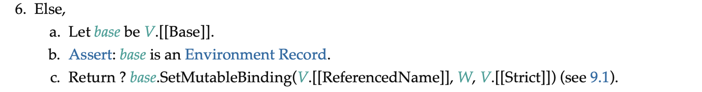

[Obfuscator] Renaming constant variable in class static block (Summarized version)
==========================================
```JavaScript
class x { static { const x = { x } = 0 ; } }
```

According to the JavaScript specification, running a JavaScript program `class x { static { const x = { x } = 0 ; } }` is expected to result in `ReferenceError`, but the output of Obfuscator is expected to result in `TypeError`.

The output of Obfuscator is as follows.
```JavaScript
class x{static{const _0x4ecb98={x}=0x0;}}
```

In summary, the bug has arised due to renaming constant variable in class static block.
1. Original code and obfuscated code both evaluates `{ x } = 0` and `{x}=0x0` to initialize `x` in `x = { x } = 0` and `_0x4ecb98` in `_0x4ecb98={x}=0x0`.
2. When resolving `x` in `{x}`, the original code resolves to `x` in `const x` and the obfuscated code resolves to `x` in `class x`.
3. The **ReferenceError** exception arises in original code because the algorithm tries to set binding for uninitialized `x`.
4. The **TypeError** exception arises in obfuscated code because the algorithm tries to change the value of an immuatble binding `x` (class name).


Below is a detailed explanation using ECMAScript Specification. The first section is about how `class x { static { const x = { x } = 0 ; } }` result in `ReferenceError`. The second section is about how the evaluation step of obfuscated code is different from original code and why the exceptions are different.

Evaluation of `class x { static { const x = { x } = 0 ; } }` is done by following algorithms.

* * *

## Evaluation of `class x { static { const x = { x } = 0 ; } }`

### #3. Operation ClassDefinitionEvaluation of ECMAScript Specifcation

In step 2 and 3, the algorithm creates a new declarative environment called `classEnv` and creates immutable binding of `x`.


In step 27, the algorithm initializes the binding of `x` with `F`, which is the evaluation result of *ClassDefinition* of x.


In step 31-b, the algorithm calls `Call` with arguments elementRecord.[[BodyFunction]] and F, where elementRecord.[[BodyFunction]] represents the `const x = { x } = 0 ;` and F represents the evaluation result of *ClassDefinition* of x.


### #8. Operation ClassStaticBlockBody.EvaluateClassStaticBlockBody of the ECMAScript specification.

This step evaluates the ClassStaticBlockBody, which represents `const x = { x } = 0 ;` and creates binding of variables in ClassStaticBlockBody in class environment.

In step 1, the algorithm calls `FunctionDeclarationInstantiation(functionObject, <<>>)`, where functionObject represents the `const x = { x } = 0 ;`.
This step creates binding of `x`, which represents the constant variable name `const x`, which is **not initialized** at this point.

In step 2, the algorithm calls the evaluation of *ClassStaticBlockStatementList*, where *ClassStaticBlockStatementList* represents `const x = { x } = 0 ;`


### #9. Evaluation of *LexicalBinding* in ECMAScript specification.

*LexicalBinding* represents `x = {x} = 0`, and it can be divided into *BindingIdentifier* `x` and *Initializer* `= {x} = 0`.

This algorithm intends to resolve *bindingId* and evaluate *Initializer* to Initialize Binding (in step 5).

In step 4, the algorithm calls the evaluation of *Initializer*.


### #10. Evaluation of *AssignmentExpression* in ECMAScript specification.

*AssignmentExpression* represents `{x} = 0`, and it can be divided into *LeftHandSideExpression* `{x}` and *AssignmentExpression* `0`.

In step 5, the algorithm calls DestructuringAssignmentEvaluation of assignmentPattern with argument rval, where rval represents 0 and assignmentPattern represents `{x}`.


### #11. Operation ObjectAssignmentPattern.DestructuringAssignment in ECMAScript specification.

*ObjectAssignmentPattern* represents `{x}` and it can be interpreted into *AssignmentPropertyList* `x`.

In step 2, the algorithm calls PropertyDestructuringAssignmentEvaluation of AssignmentPropertyList with argument value, where value represents 0.


### #12. Operation AssignmentProperty.PropertyDestructuringAssignmentEvaluation in ECMASCript specification.

In step 1, P refers to `x`.

In step 2, lref represents the constant variable `x`.

In step 5, the algorithm calls PutValue(lref, v), where lref represents a reference of constant variable `x` and v represents *undefined* value.


### #13. Operation PutValue in ECMAScript specification.

The operation PutValue takes arguments *V* and *W*, where *V* represents a reference of constant variable `x` and *W* represents *undefined* value.

In step 6-c, the algorithm calls SetMutableBinding with arguments base, V.[[ReferencedName]], W, and V.[[Strict]], where base represents the environment that binding of constant variable `x` is stored.



### #14. Operation SetMutableBinding in ECMAScript specification.

In step 3, the algorithm throws a **ReferenceError** exception, because the binding for N, which is `x` in envRec has not yet been initialized.

In detail, the `x` in envRec refers the `x` in `const x`. Therefore, it has not been initialized.


In short, in #9, the evaluation of LexicalBinding, the algorithm evaluates AssignmentExpression `{x}=0` to initialize the value of the constant variable `x`. However, while evaluating `{x}=0`, in #12, the algorithm resolves the `x` in the AssignmentExpression as the constant variable `x` and tries to assign value. Then, **ReferenceError** occurs in # 14, because the constant variable `x` has not been initialized yet.

* * *

Evaluation of class x{static{const _0x4ecb98={x}=0x0;}}
-----------------------------------------------------------

In comparison, the evaluation of the obfuscated JavaScript program is similar but different in following steps.

### #8(Obs). Operation ClassStaticBlockBody.EvaluateClassStaticBlockBody of the ECMAScript specification.

In step 1, the algorithm calls `FunctionDeclarationInstantiation(functionObject, <<>>)`, where functionObject represents the `const _0x4ecb98 = { x } = 0x0 ;`.
This step creates an immutable binding of `_0x4ecb98` in class environment.

In step 2, the algorithm calls the evaluation of *ClassStaticBlockStatementList*, where *ClassStaticBlockStatementList* represents `const _0x4ecb98 = { x } = 0x0 ;`.

### #12(Obs). Operation AssignmentProperty.PropertyDestructuringAssignmentEvaluation in ECMASCript specification.

In step 1, P refers to `x`.

There is a significant difference in step 2.
In step 2, lref represents the class `x`.

In step 5, the algorithm calls PutValue(lref, v), where lref represents a reference of the class `x` and v represents *undefined* value.

### #14. Operation SetMutableBinding in ECMAScript specification.

In step 5-b, the algorithm throws a **TypeError** exception, because the binding for N, which is `x` in envRec is an immutable binding.

Since this is an attempt to change the value of an immuatble binding, the algorithm throws **TypeError** exception.

In detail, the `x` in envRec refers the `x` in `class x`.