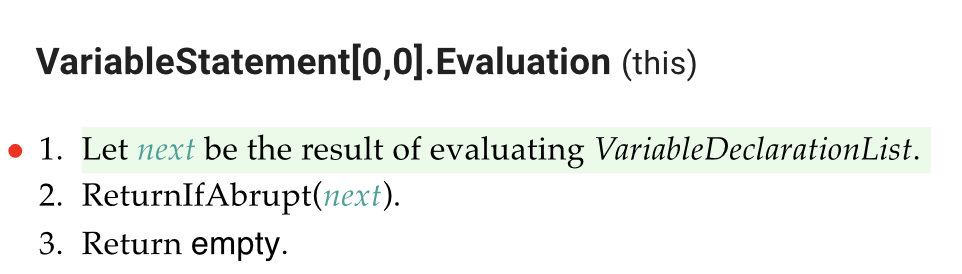
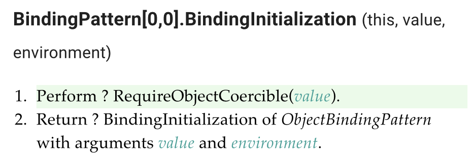

Week 2 Research Note
====================
URP 프로그램 1주차 연구노트 (1/9 ~ 1/15)

이번 주에는 ECMAScript Debugger 사용과 ECMAScript Specification 읽기에 익숙해지는 걸 목표로 했고, 사수님께서 주신 Babel의 버그 리포트를 ECMAScript Specification을 참조해서 직접 작성해보았습니다.
* * *

Babel Bug Report (2022-01-11)
--------------------

### [Bug]: Destructuring null with rest #14982

According to the ECMAScript specification, running a JavaScript program `var { ... x } = null ;` is expected to result in `TypeError` but using Babel terminates without error.

Below is a detailed explanation using ECMAScript specification.
Evaluation of `var { ... x } = null ;` is done by following algorithms.

#### 1. Evaluation of *VariableStatement* : **var** *VariableDeclarationList* of the ECMAScript specification

The algorithms calls the evaluation of *VariableDeclarationList* in step 1, where *VariableDeclarationList* represents `{ ... x } = null ;`.

#### 2. Evaluation of *VariableDeclaration* : *BindingPattern* *Initializer* of the ECMAScript specification

The algorithm calls BindingInitialization of *BindingPattern* with arguments *rval* and **undefined**, where rval is `null`.

#### 3. Operation BindingInitialization of the ECMAScript specification

The algorithm calls RequireObjectCoercible, where *value* is `null`.

#### 4. Operation RequireObjectCoercible of the ECMAScript specification

RequireObjectCoercible throw `TypeError` exception, when argument type is Null.

Therefore the program should throw `TypeError` exception.

* * *

| 기록자: 김재령 | 일자: 1월 8일 | 확인자: 이강욱 | 일자: |
|----------------|---------------|----------------|-------|